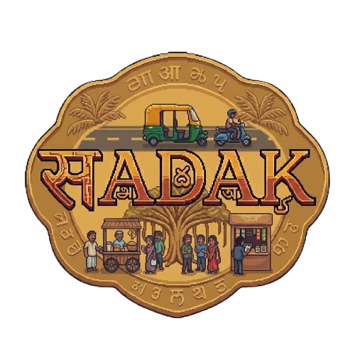
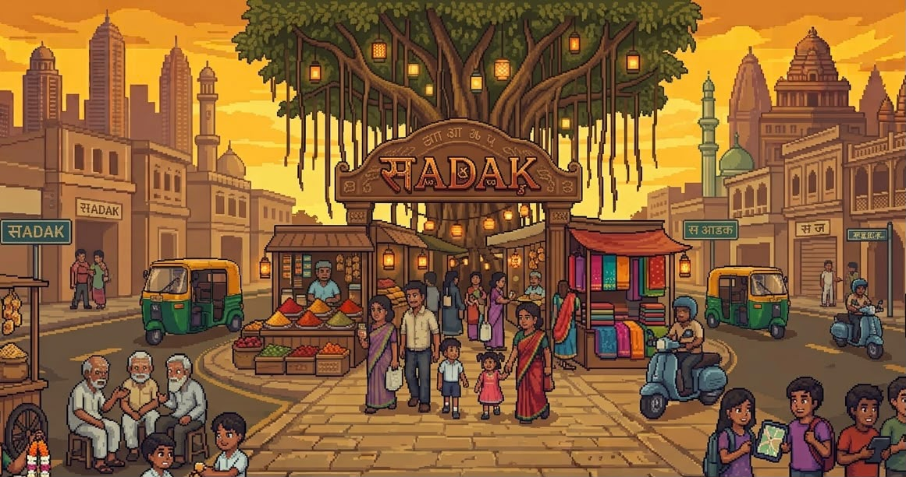
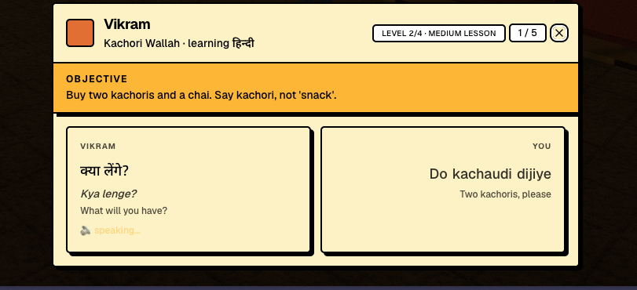

<p align="center">
  
</p>

<h1 align="center">SADAK</h1>

<p align="center">
  <b>Ten Indian cities. Talk your way through.</b><br/>
  An interactive, voice-first game where you learn new languages through everyday conversations.
</p>

<p align="center">
  <a href="https://playsadak.vercel.app"><b>Play now →</b></a>
</p>

<p align="center">
  
</p>

## About

SADAK drops you into real Indian neighbourhoods, rebuilt from OpenStreetMap, with a list of everyday errands in each one: stop an auto, order at a food stall, buy an offering at the temple, catch a bus, and one errand that belongs to that city. You get them done by walking up to people and **speaking to them** in Hindi, Tamil, Kannada, Bengali, Telugu, Malayalam, Marathi, Gujarati, Punjabi or Odia.

Each errand is a short spoken lesson. The character says a line, you see what to say back in script and romanisation, with its meaning in whichever language you read best, and every word you say is scored. Every voice, in both directions, runs on [Sarvam AI](https://www.sarvam.ai). You leave each district knowing a few real sentences you didn't know before.

## Screenshots

<table>
  <tr>
    <td></td>
    <td></td>
  </tr>
  <tr>
    <td align="center"><sub>Chandni Chowk, Old Delhi</sub></td>
    <td align="center"><sub>Charminar, Hyderabad</sub></td>
  </tr>
  <tr>
    <td></td>
    <td></td>
  </tr>
  <tr>
    <td align="center"><sub>Dadar, Mumbai</sub></td>
    <td align="center"><sub>Fort Kochi, Kochi</sub></td>
  </tr>
</table>

<p align="center">
  <br/>
  <sub>Every line comes with script, romanisation and its meaning in your language.</sub>
</p>

## Features

- **Talk, don't click.** Hold to speak, and the character answers out loud in their own language.
- **10 districts, 10 languages.** Each with five everyday errands, its own characters and a phrasebook.
- **Word-by-word feedback.** Each line you speak is matched against the phrase, word by word.
- **Learn from the language you know.** Instructions and meanings come in English or any of the ten Indian languages, so a Tamil speaker can learn Bengali through Tamil.
- **Three difficulty levels.** Pick easy, medium or hard and the lessons change with it.
- **Characters who remember you.** Come back to someone you've already met and they greet you with something you told them last time.
- **Real maps.** Street networks, landmarks and transit from OpenStreetMap, cel-shaded in three.js.

## How it works

```
scripted NPC line → bulbul:v3 (TTS) → you hear it, with script, romanisation and its meaning in your language
your reply → saaras:v4 (STT) → word-by-word score against the target phrase
return visit → sarvam-105b writes a line that remembers your last conversation
```

The game lives in [`game_engine/`](game_engine/README.md): Next.js, three.js, Sarvam (TTS, STT, LLM) and Supabase (auth and progress).

## Quick start

**Prerequisites:** Node 18.18+, keys for [Sarvam AI](https://dashboard.sarvam.ai) and [Supabase](https://supabase.com).

```bash
cd game_engine
npm install
cp .env.example .env        # Sarvam and Supabase keys
npm run dev                 # http://localhost:3000
```

Supabase setup (migrations, auth redirect URLs) is in the [game README](game_engine/README.md).

## Docs

- [Game engine](game_engine/README.md): architecture, setup, design notes
- [Voice agent](docs/VOICE_AGENT.md): the LiveKit worker in `agent.py` (not used by the game at the moment)
- [Deploy](docs/DEPLOY.md): Vercel and Supabase production setup
- [Handover](docs/HANDOVER.md): current state, latency measurements, logs

## Credits

Built by [ahmedfahim21](https://github.com/ahmedfahim21), [Parth Mittal](https://github.com/mittal-parth), [Apoorva Agrawal](https://github.com/imApoorva36) and [Mardav Gandhi](https://github.com/marcdhi).

- Speech, language and voices by [Sarvam AI](https://www.sarvam.ai): Saaras (STT), sarvam-105b (LLM), Bulbul (TTS).
- Map data © [OpenStreetMap](https://www.openstreetmap.org/copyright) contributors, available under the Open Database License (ODbL 1.0).
- The cel-shaded look is adapted from [sakura-crossing](https://github.com/Kenton-GMI/sakura-crossing) by Kenton Wang (MIT).
